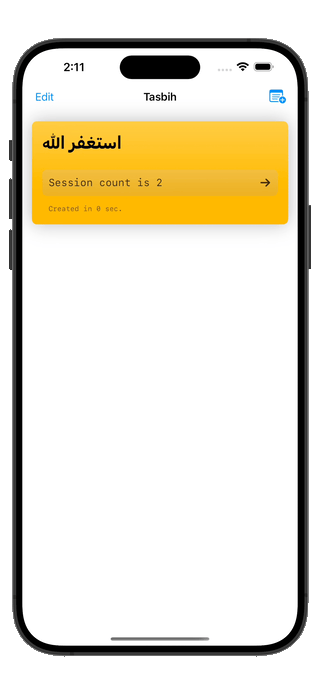

# Tasbih App

**Tasbih** is an intuitive, user-friendly mobile application designed to aid Muslims around the globe in their daily dhikr (remembrance of Allah). This app serves as a digital counterpart to the traditional tasbih beads, offering a portable and accessible way to track tasbih counts, remember daily prayers, and maintain spiritual mindfulness throughout the day.

### See it in action
Feel free to jin the beta testers via TestrFlight [public link]()
| Tasbih app |
| -------------------------- |
|  |

## Features:
- **Digital Tasbih Counter:** Simulates the traditional tasbih beads with a simple, easy-to-use interface for counting.
- **Customizable Dhikr Presets:** Users can select from pre-loaded dhikr phrases or create custom ones to suit their personal spiritual practices.
- **Daily Dhikr Goals:** Set and track daily dhikr goals to encourage regular spiritual practice.
- **Reminders:** Configurable reminders for daily prayers and dhikr sessions to help maintain consistency in worship.
- **History & Statistics:** View historical dhikr counts and track spiritual progress over time.
- **Multi-Language Support:** Available in multiple languages to cater to a global Muslim community.

## Contributing
We warmly welcome contributions from the community! Whether you're looking to fix bugs, add new features, or improve the documentation, your help is greatly appreciated. Please refer to our [CONTRIBUTING.md](#) for guidelines on how to make contributions.

## License
This project is licensed under the MIT License - see the [LICENSE.md](#) file for details.

## Connect with Us
- **[GitHub Issues](#)** for bug reports, feature requests, or submitting pull requests.

## Support Us
If you find the Tasbih app useful, consider supporting us through sharing the app or by contributing to the project. Your support helps us to continue improving the app and adding new features.
